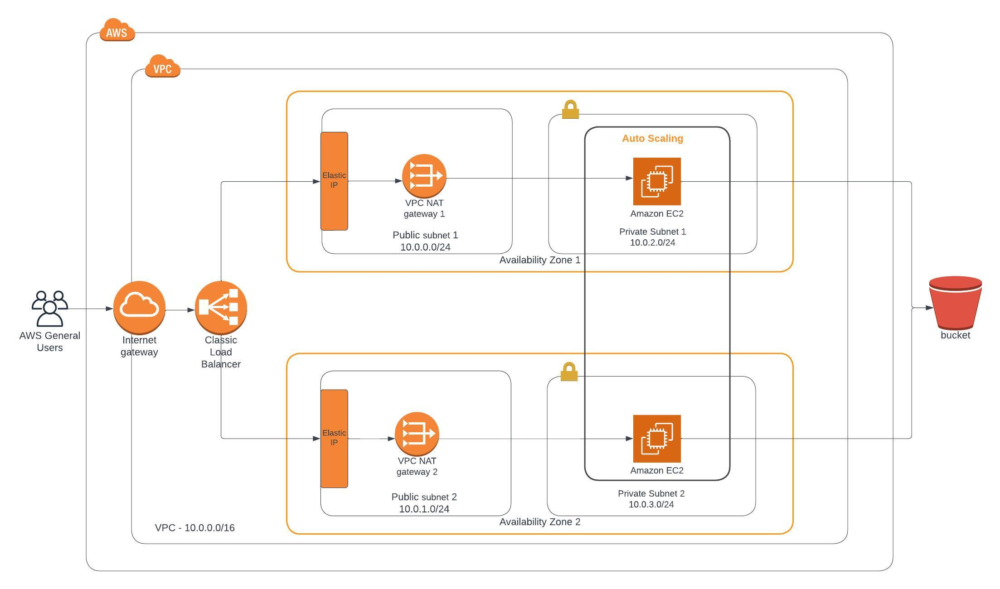
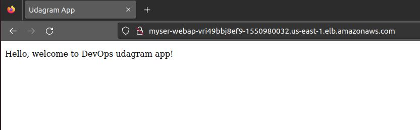

# Udagram DevOps Deploy a high-availability web app using CloudFormation
This project deploys a web appplication.
Using cloudformation template to deploy all resources

## Cloud architecture


## Project structure
- `/scripts`: contains scripts file to create, update, delete stack
- `/webapp`; contains webapp server files. In this project, it only contains index.html file
- `networks.yml`, `networks-params.json`: template files for network resource creation
- `servers.yml`, `servers-params.json`: template files for server resource creation

## Project configure:
- Deploy web app to S3 bucket, s3 file path: "s3://udagram-devops-project2-bucket/index.html"

- Create network resources
```
$ scripts/update.sh mynetworks networks.yml networks-params.json
```

- Create Server resources
```
$ scripts/create.sh myservers servers.yml servers-params.json
```

## Result
- URL of Load Balancer: http://myser-webap-vri49bbj8ef9-1550980032.us-east-1.elb.amazonaws.com
